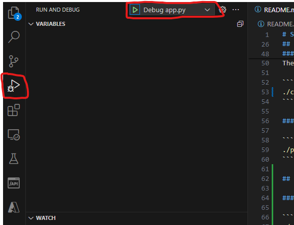

# Sample Python Dash App with Secret Management

## Python Configuration 

This configuration only needs to be done once.

### Step 1: Create virtual environment

```bash
python -m venv venv
```

### Step 2: Activate Virtual Environment
Open a powershell console (or terminal in VS Code)

```bash
./venv/scripts/activate
```

### Step 3: Load Python Requirements

```bash
pip install -r requirements.txt
```

## Running the application from the command line

### Pre-requisite: Load all Azure Keyvault secrets into local Powershell Vault

This configuration only needs to be done once.

The following script will copy all secrets from the DataHub Keyvault into local vault. 
Once this is done, it is not necessary to connect to Azure to execute the application. The Python application can then work offline.

A secret is required in the script to lock the local vault. The same secret will be required later to read secrets from the vault. The local vault is a better alternative to a plain text to store secrets.

```bash
./load-secrets.ps1.
```

### Step 1: Activate Virtual Environment
Open a powershell console (or terminal in VS Code)

```bash
./venv/scripts/activate
```

### Step 2: Configure the environment

The following script will load into environment variables the secrets from the local vault.

```bash
./configure-env.ps1
```

### Step 3: Run the application

```bash
./python app.py
```

## Running the application from Visual Code

### Configure the launch.json

```bash
./configure-launch.ps1
```

The promp will ask for Azure credentials to retrieve secrests from the Key vault and it will store them into `launch.json`

> **Important Note:** `launch.json` needs to be included in .gitignore otherwise the secrets will be uploaded to the git repository.

### Start the application in Debug Mode

- Open the "Run and Debug" menu in Visual Code
- Select the `Play` button in the top bar to launch the application


